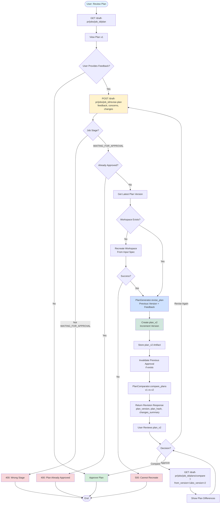
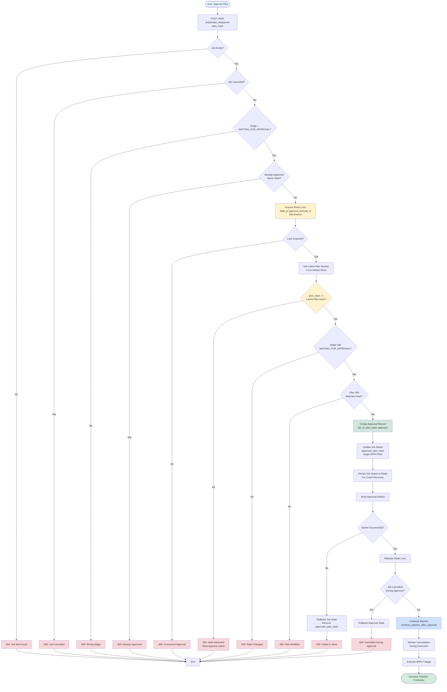
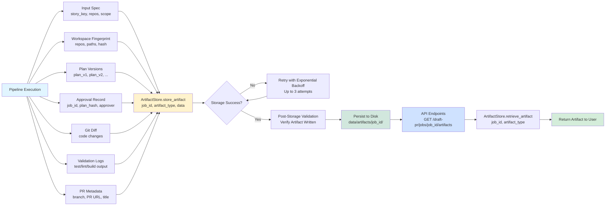
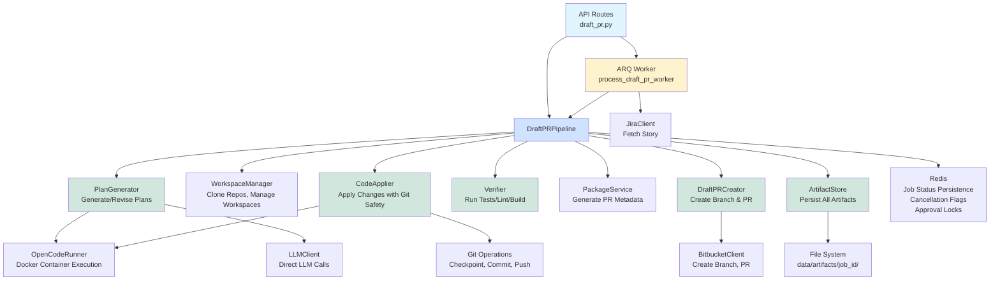

# Draft PR Orchestrator Flow Diagram

## Complete Pipeline Flow

```mermaid
flowchart TD
    Start([User: Create Draft PR Job]) --> CreateAPI[POST /draft-pr/create]
    CreateAPI --> CheckDuplicate{Duplicate Job?}
    CheckDuplicate -->|Yes| Error409[409 Conflict]
    CheckDuplicate -->|No| CreateJob[Create Job Status<br/>job_id, stage=CREATED]
    CreateJob --> QueueJob[Queue ARQ Worker Job]
    QueueJob --> WorkerStart[Worker: process_draft_pr_worker]
    
    WorkerStart --> FetchJIRA[Fetch Story from JIRA<br/>summary, description]
    FetchJIRA --> InitPipeline[Initialize Pipeline Services<br/>PlanGenerator, WorkspaceManager,<br/>ArtifactStore, OpenCodeRunner]
    
    InitPipeline --> Stage1[STAGE 1: PLANNING]
    Stage1 --> CreateWorkspace[Create Workspace<br/>Clone Repositories]
    CreateWorkspace --> CheckCancel1{Cancelled?}
    CheckCancel1 -->|Yes| Cleanup1[Cleanup Workspace]
    Cleanup1 --> CancelEnd([Job Cancelled])
    
    CheckCancel1 -->|No| GeneratePlan[Generate Plan v1<br/>PlanGenerator.generate_plan]
    GeneratePlan --> StorePlan1[Store plan_v1 Artifact]
    StorePlan1 --> CheckCancel2{Cancelled?}
    CheckCancel2 -->|Yes| Cleanup2[Cleanup Workspace]
    Cleanup2 --> CancelEnd
    
    CheckCancel2 -->|No| CheckMode{Mode?}
    
    CheckMode -->|YOLO| YOLOEvaluate[YOLO Policy Evaluation]
    YOLOEvaluate --> YOLOCompliant{Compliant?}
    YOLOCompliant -->|Yes| AutoApprove[Auto-Approve Plan]
    AutoApprove --> Stage3[STAGE 3: APPLY]
    YOLOCompliant -->|No| Stage2[STAGE 2: WAITING_FOR_APPROVAL]
    
    CheckMode -->|Normal| Stage2
    
    Stage2 --> WaitApproval[Job Paused<br/>Waiting for User Approval]
    WaitApproval --> UserReview[User Reviews Plan<br/>GET /draft-pr/jobs/job_id/plan]
    UserReview --> UserDecision{User Decision?}
    
    UserDecision -->|Revise| RevisePlan[POST /draft-pr/jobs/job_id/revise-plan]
    RevisePlan --> GenerateRevPlan[PlanGenerator.revise_plan<br/>Generate plan_v2, v3, ...]
    GenerateRevPlan --> StoreRevPlan[Store plan_vN Artifact]
    StoreRevPlan --> InvalidateApproval[Invalidate Previous Approval]
    InvalidateApproval --> WaitApproval
    
    UserDecision -->|Approve| ApproveAPI[POST /draft-pr/jobs/job_id/approve]
    ApproveAPI --> CheckCancel3{Cancelled?}
    CheckCancel3 -->|Yes| ErrorCancel[400: Job Cancelled]
    CheckCancel3 -->|No| AcquireLock[Acquire Redis Lock<br/>Prevent Concurrent Approval]
    AcquireLock --> VerifyPlanHash[Verify Plan Hash<br/>Must Match Latest Plan]
    VerifyPlanHash --> StoreApproval[Store Approval Artifact]
    StoreApproval --> UpdateJob[Update Job Status<br/>approved_plan_hash, stage=APPLYING]
    UpdateJob --> ReleaseLock[Release Redis Lock]
    ReleaseLock --> ContinuePipeline[continue_pipeline_after_approval]
    
    ContinuePipeline --> Stage3
    
    Stage3 --> CheckCancel4{Cancelled?}
    CheckCancel4 -->|Yes| Cleanup3[Cleanup Workspace]
    Cleanup3 --> CancelEnd
    
    CheckCancel4 -->|No| ApplyCode[CodeApplier.apply_plan<br/>Execute OpenCode Container]
    ApplyCode --> GitCheckpoint[Create Git Checkpoint<br/>Before Changes]
    GitCheckpoint --> ExecuteOpenCode[Run OpenCode<br/>Apply Code Changes]
    ExecuteOpenCode --> VerifyPlanApply{Plan-Apply Guard<br/>Changes Match Plan?}
    VerifyPlanApply -->|No| RollbackGit[Rollback to Checkpoint]
    RollbackGit --> ErrorPlanMismatch[Error: Plan Mismatch]
    
    VerifyPlanApply -->|Yes| StoreDiff[Store Git Diff Artifact]
    StoreDiff --> CheckCancel5{Cancelled?}
    CheckCancel5 -->|Yes| Cleanup4[Cleanup Workspace]
    Cleanup4 --> CancelEnd
    
    CheckCancel5 -->|No| Stage4[STAGE 4: VERIFY]
    
    Stage4 --> CheckCancel6{Cancelled?}
    CheckCancel6 -->|Yes| Cleanup5[Cleanup Workspace]
    Cleanup5 --> CancelEnd
    
    CheckCancel6 -->|No| RunTests[Verifier.verify<br/>Run Test Command]
    RunTests --> RunLint[Run Lint Command]
    RunLint --> RunBuild[Run Build Command]
    RunBuild --> VerifyPass{All Passed?}
    VerifyPass -->|No| StoreLogs[Store Validation Logs]
    StoreLogs --> ErrorVerify[Error: Verification Failed]
    
    VerifyPass -->|Yes| StoreLogs2[Store Validation Logs]
    StoreLogs2 --> CheckCancel7{Cancelled?}
    CheckCancel7 -->|Yes| Cleanup6[Cleanup Workspace]
    CheckCancel6 --> CancelEnd
    
    CheckCancel7 -->|No| Stage5[STAGE 5: PACKAGE]
    
    Stage5 --> PackageService[PackageService.package<br/>Generate PR Metadata]
    PackageService --> StorePRMeta[Store PR Metadata Artifact]
    StorePRMeta --> Stage6[STAGE 6: DRAFT_PR]
    
    Stage6 --> DetectDefaultBranch[Detect Default Branch<br/>main/master/develop]
    DetectDefaultBranch --> CreateBranch[Create Branch<br/>augment/ticket-key-hash]
    CreateBranch --> BranchExists{Branch Exists?}
    BranchExists -->|Yes| RetryBranch[Retry with Suffix<br/>-1, -2, ... up to 5]
    RetryBranch --> BranchExists
    
    BranchExists -->|No| PushBranch[Push Branch to Bitbucket]
    PushBranch --> CreatePR[Create Draft PR<br/>Link to Story]
    CreatePR --> PRSuccess{PR Created?}
    PRSuccess -->|Partial| StorePartial[Store Partial Failure<br/>Branch exists, PR failed]
    StorePartial --> ErrorPartial[Error: Partial Failure]
    
    PRSuccess -->|Yes| StorePRMeta2[Update PR Metadata<br/>pr_id, pr_url]
    StorePRMeta2 --> Stage7[STAGE 7: COMPLETED]
    
    Stage7 --> CleanupWorkspace[Cleanup Workspace]
    CleanupWorkspace --> UpdateJobComplete[Update Job Status<br/>status=completed, PR URL]
    UpdateJobComplete --> Success([Success: Draft PR Created])
    
    Error409 --> End1([End])
    ErrorCancel --> End2([End])
    ErrorPlanMismatch --> End3([End])
    ErrorVerify --> End4([End])
    ErrorPartial --> End5([End])
    CancelEnd --> End6([End])
    
    style Start fill:#e1f5ff
    style Success fill:#d4edda
    style Stage1 fill:#fff3cd
    style Stage2 fill:#fff3cd
    style Stage3 fill:#fff3cd
    style Stage4 fill:#fff3cd
    style Stage5 fill:#fff3cd
    style Stage6 fill:#fff3cd
    style Stage7 fill:#d4edda
    style Error409 fill:#f8d7da
    style ErrorCancel fill:#f8d7da
    style ErrorPlanMismatch fill:#f8d7da
    style ErrorVerify fill:#f8d7da
    style ErrorPartial fill:#f8d7da
    style CancelEnd fill:#f8d7da
    style WaitApproval fill:#cfe2ff
    style YOLOEvaluate fill:#e7f3ff
    style AutoApprove fill:#d1e7dd
```

## Plan Revision Flow

## Approval Flow with Safety Checks

## Artifact Persistence Flow

## Component Interactions

## Key Features Highlighted

1. **Pipeline Stages**: 7 distinct stages from CREATED to COMPLETED
2. **Two Modes**: Normal (human approval) and YOLO (auto-approval)
3. **Plan Iteration**: Users can revise plans multiple times
4. **Safety Mechanisms**: Plan hash binding, plan-apply guards, git transaction safety
5. **Cancellation Support**: Can cancel at any stage with proper cleanup
6. **Artifact Persistence**: All artifacts stored for auditability
7. **Error Handling**: Comprehensive error handling with rollback capabilities
8. **Distributed Locking**: Prevents concurrent approval requests
9. **Crash Recovery**: Job status persisted to Redis for recovery
