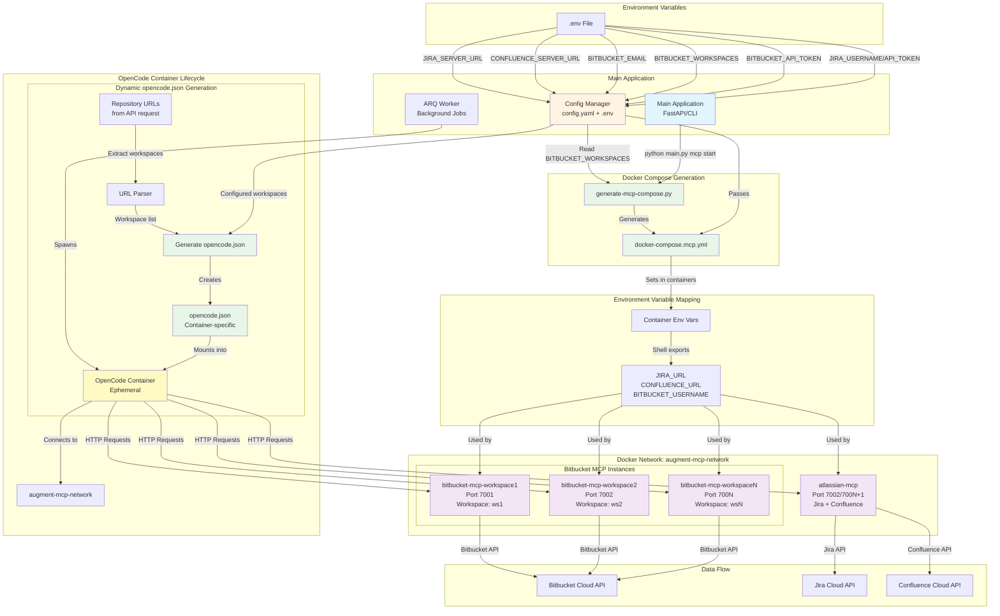
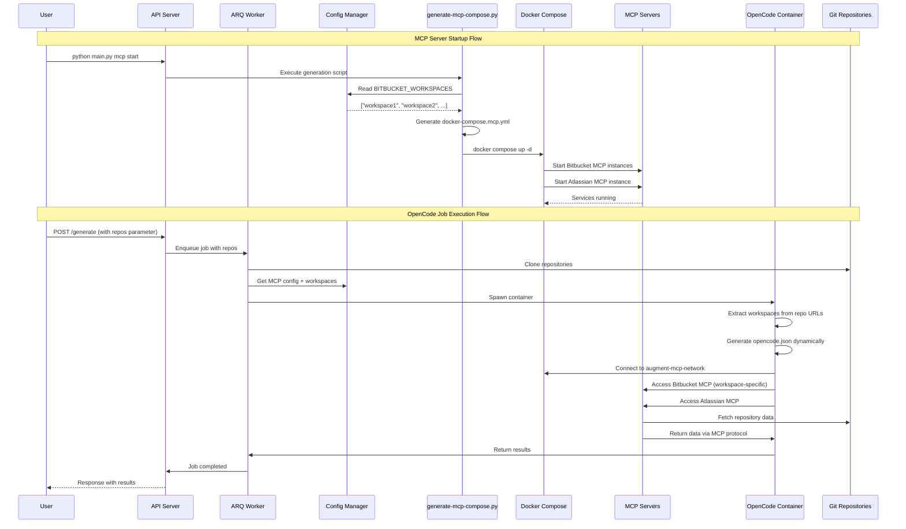
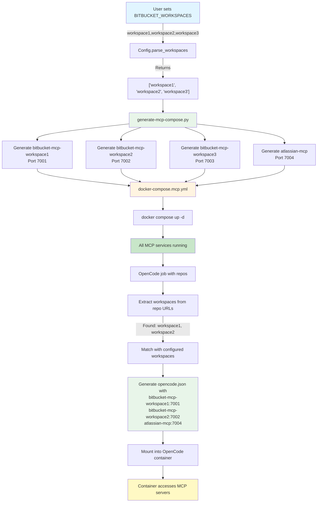
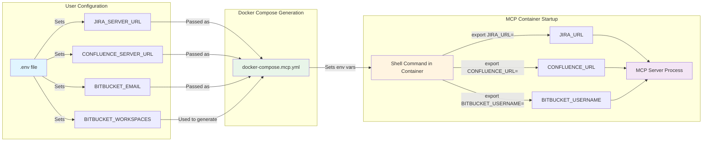
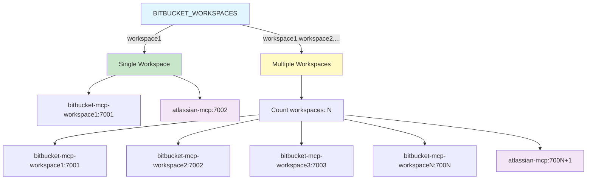

# MCP Architecture Diagram

## System Architecture

```mermaid
graph TB
    subgraph "Main Application"
        APP[Main Application<br/>FastAPI/CLI]
        CONFIG[Config Manager<br/>config.yaml + .env]
        WORKER[ARQ Worker<br/>Background Jobs]
    end

    subgraph "Environment Variables"
        ENV[.env File]
        ENV -->|JIRA_SERVER_URL| CONFIG
        ENV -->|CONFLUENCE_SERVER_URL| CONFIG
        ENV -->|BITBUCKET_EMAIL| CONFIG
        ENV -->|BITBUCKET_WORKSPACES| CONFIG
        ENV -->|BITBUCKET_API_TOKEN| CONFIG
        ENV -->|JIRA_USERNAME/API_TOKEN| CONFIG
    end

    subgraph "Docker Compose Generation"
        GEN_SCRIPT[generate-mcp-compose.py]
        CONFIG -->|Read BITBUCKET_WORKSPACES| GEN_SCRIPT
        GEN_SCRIPT -->|Generates| COMPOSE[docker-compose.mcp.yml]
        APP -->|python main.py mcp start| GEN_SCRIPT
    end

    subgraph "Docker Network: augment-mcp-network"
        subgraph "Bitbucket MCP Instances"
            BB1[bitbucket-mcp-workspace1<br/>Port 7001<br/>Workspace: ws1]
            BB2[bitbucket-mcp-workspace2<br/>Port 7002<br/>Workspace: ws2]
            BB3[bitbucket-mcp-workspaceN<br/>Port 700N<br/>Workspace: wsN]
        end
        
        ATL[atlassian-mcp<br/>Port 7002/700N+1<br/>Jira + Confluence]
    end

    subgraph "OpenCode Container Lifecycle"
        WORKER -->|Spawns| OC_CONTAINER[OpenCode Container<br/>Ephemeral]
        OC_CONTAINER -->|Connects to| NETWORK[augment-mcp-network]
        
        subgraph "Dynamic opencode.json Generation"
            REPOS[Repository URLs<br/>from API request]
            REPOS -->|Extract workspaces| EXTRACT[URL Parser]
            EXTRACT -->|Workspace list| GEN_JSON[Generate opencode.json]
            CONFIG -->|Configured workspaces| GEN_JSON
            GEN_JSON -->|Creates| JSON_FILE[opencode.json<br/>Container-specific]
            JSON_FILE -->|Mounts into| OC_CONTAINER
        end
    end

    subgraph "Environment Variable Mapping"
        CONFIG -->|Passes| COMPOSE
        COMPOSE -->|Sets in containers| ENV_VARS[Container Env Vars]
        ENV_VARS -->|Shell exports| MAPPED[JIRA_URL<br/>CONFLUENCE_URL<br/>BITBUCKET_USERNAME]
        MAPPED -->|Used by| BB1
        MAPPED -->|Used by| BB2
        MAPPED -->|Used by| BB3
        MAPPED -->|Used by| ATL
    end

    subgraph "Data Flow"
        OC_CONTAINER -->|HTTP Requests| BB1
        OC_CONTAINER -->|HTTP Requests| BB2
        OC_CONTAINER -->|HTTP Requests| BB3
        OC_CONTAINER -->|HTTP Requests| ATL
        BB1 -->|Bitbucket API| BITBUCKET_CLOUD[Bitbucket Cloud API]
        BB2 -->|Bitbucket API| BITBUCKET_CLOUD
        BB3 -->|Bitbucket API| BITBUCKET_CLOUD
        ATL -->|Jira API| JIRA_CLOUD[Jira Cloud API]
        ATL -->|Confluence API| CONFLUENCE_CLOUD[Confluence Cloud API]
    end

    style APP fill:#e1f5ff
    style CONFIG fill:#fff4e1
    style GEN_SCRIPT fill:#e8f5e9
    style COMPOSE fill:#e8f5e9
    style BB1 fill:#f3e5f5
    style BB2 fill:#f3e5f5
    style BB3 fill:#f3e5f5
    style ATL fill:#f3e5f5
    style OC_CONTAINER fill:#fff9c4
    style GEN_JSON fill:#e8f5e9
    style JSON_FILE fill:#e8f5e9
```

## Component Interaction Flow

```mermaid
sequenceDiagram
    participant User
    participant API as API Server
    participant Worker as ARQ Worker
    participant Config as Config Manager
    participant GenScript as generate-mcp-compose.py
    participant Docker as Docker Compose
    participant MCP as MCP Servers
    participant OpenCode as OpenCode Container
    participant Repos as Git Repositories

    Note over User,Repos: MCP Server Startup Flow
    User->>API: python main.py mcp start
    API->>GenScript: Execute generation script
    GenScript->>Config: Read BITBUCKET_WORKSPACES
    Config-->>GenScript: ["workspace1", "workspace2", ...]
    GenScript->>GenScript: Generate docker-compose.mcp.yml
    GenScript->>Docker: docker compose up -d
    Docker->>MCP: Start Bitbucket MCP instances
    Docker->>MCP: Start Atlassian MCP instance
    MCP-->>Docker: Services running

    Note over User,Repos: OpenCode Job Execution Flow
    User->>API: POST /generate (with repos parameter)
    API->>Worker: Enqueue job with repos
    Worker->>Repos: Clone repositories
    Worker->>Config: Get MCP config + workspaces
    Worker->>OpenCode: Spawn container
    OpenCode->>OpenCode: Extract workspaces from repo URLs
    OpenCode->>OpenCode: Generate opencode.json dynamically
    OpenCode->>Docker: Connect to augment-mcp-network
    OpenCode->>MCP: Access Bitbucket MCP (workspace-specific)
    OpenCode->>MCP: Access Atlassian MCP
    MCP->>Repos: Fetch repository data
    MCP->>OpenCode: Return data via MCP protocol
    OpenCode->>Worker: Return results
    Worker->>API: Job completed
    API-->>User: Response with results
```

## Multi-Workspace Configuration Flow

```mermaid
flowchart TD
    START[User sets BITBUCKET_WORKSPACES]
    START -->|"workspace1,workspace2,workspace3"| PARSE[Config.parse_workspaces]
    PARSE -->|Returns| LIST["['workspace1', 'workspace2', 'workspace3']"]
    LIST --> GENERATE[generate-mcp-compose.py]
    
    GENERATE --> BB1_GEN[Generate bitbucket-mcp-workspace1<br/>Port 7001]
    GENERATE --> BB2_GEN[Generate bitbucket-mcp-workspace2<br/>Port 7002]
    GENERATE --> BB3_GEN[Generate bitbucket-mcp-workspace3<br/>Port 7003]
    GENERATE --> ATL_GEN[Generate atlassian-mcp<br/>Port 7004]
    
    BB1_GEN --> COMPOSE_FILE[docker-compose.mcp.yml]
    BB2_GEN --> COMPOSE_FILE
    BB3_GEN --> COMPOSE_FILE
    ATL_GEN --> COMPOSE_FILE
    
    COMPOSE_FILE --> DOCKER_START[docker compose up -d]
    DOCKER_START --> RUNNING[All MCP services running]
    
    RUNNING --> OC_JOB[OpenCode job with repos]
    OC_JOB --> EXTRACT[Extract workspaces from repo URLs]
    EXTRACT -->|"Found: workspace1, workspace2"| MATCH[Match with configured workspaces]
    MATCH --> JSON_GEN[Generate opencode.json with<br/>bitbucket-mcp-workspace1:7001<br/>bitbucket-mcp-workspace2:7002<br/>atlassian-mcp:7004]
    JSON_GEN --> MOUNT[Mount into OpenCode container]
    MOUNT --> ACCESS[Container accesses MCP servers]
    
    style START fill:#e1f5ff
    style GENERATE fill:#e8f5e9
    style COMPOSE_FILE fill:#fff4e1
    style RUNNING fill:#c8e6c9
    style JSON_GEN fill:#e8f5e9
    style ACCESS fill:#fff9c4
```

## Environment Variable Flow

```mermaid
graph LR
    subgraph "User Configuration"
        ENV_FILE[.env file]
        ENV_FILE -->|Sets| JIRA_SERVER_URL[JIRA_SERVER_URL]
        ENV_FILE -->|Sets| CONFLUENCE_SERVER_URL[CONFLUENCE_SERVER_URL]
        ENV_FILE -->|Sets| BITBUCKET_EMAIL[BITBUCKET_EMAIL]
        ENV_FILE -->|Sets| BITBUCKET_WORKSPACES[BITBUCKET_WORKSPACES]
    end

    subgraph "Docker Compose Generation"
        COMPOSE[docker-compose.mcp.yml]
        JIRA_SERVER_URL -->|Passed as| COMPOSE
        CONFLUENCE_SERVER_URL -->|Passed as| COMPOSE
        BITBUCKET_EMAIL -->|Passed as| COMPOSE
        BITBUCKET_WORKSPACES -->|Used to generate| COMPOSE
    end

    subgraph "MCP Container Startup"
        SHELL[Shell Command in Container]
        COMPOSE -->|Sets env vars| SHELL
        SHELL -->|export JIRA_URL=| MAPPED1[JIRA_URL]
        SHELL -->|export CONFLUENCE_URL=| MAPPED2[CONFLUENCE_URL]
        SHELL -->|export BITBUCKET_USERNAME=| MAPPED3[BITBUCKET_USERNAME]
        MAPPED1 --> MCP_SERVER[MCP Server Process]
        MAPPED2 --> MCP_SERVER
        MAPPED3 --> MCP_SERVER
    end

    style ENV_FILE fill:#e1f5ff
    style COMPOSE fill:#e8f5e9
    style SHELL fill:#fff4e1
    style MCP_SERVER fill:#f3e5f5
```

## Port Allocation Strategy

```mermaid
graph TD
    START[BITBUCKET_WORKSPACES]
    START -->|"workspace1"| SINGLE[Single Workspace]
    START -->|"workspace1,workspace2,..."| MULTI[Multiple Workspaces]
    
    SINGLE --> PORT1[bitbucket-mcp-workspace1:7001]
    SINGLE --> PORT_ATL1[atlassian-mcp:7002]
    
    MULTI --> COUNT[Count workspaces: N]
    COUNT --> PORT_N1[bitbucket-mcp-workspace1:7001]
    COUNT --> PORT_N2[bitbucket-mcp-workspace2:7002]
    COUNT --> PORT_N3[bitbucket-mcp-workspace3:7003]
    COUNT --> PORT_NN[bitbucket-mcp-workspaceN:700N]
    COUNT --> PORT_ATL2[atlassian-mcp:700N+1]
    
    style START fill:#e1f5ff
    style SINGLE fill:#c8e6c9
    style MULTI fill:#fff9c4
    style PORT_ATL1 fill:#f3e5f5
    style PORT_ATL2 fill:#f3e5f5
```
